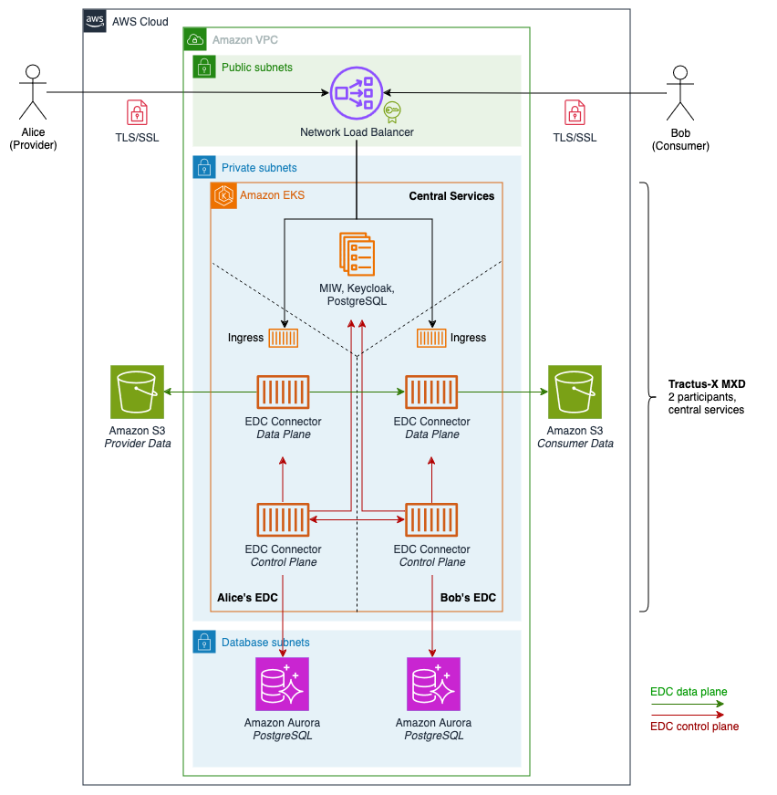

# Minimum Viable Dataspace for Catena-X on AWS

In October 2023, the Catena-X Automotive Network was productively launched. [Catena-X](https://catena-x.net/) aims to create greater transparency by building a trustworthy, collaborative, open and secure data ecosystem for the automotive industry. [AWS joined Catena-X](https://aws.amazon.com/blogs/industries/aws-joins-catena-x/) as a member in January 2023.

This sample extends Catena-X' [Tractus-X MXD implementation](https://github.com/eclipse-tractusx/tutorial-resources/tree/main/mxd) to deploy a single-command Minimum Viable Dataspace (MVD) for Catena-X on AWS. For users, this serves as a starting point for experimentation around Catena-X onboarding, implementation against the Eclipse Dataspace Components' (EDC) API and realization of initial use cases. This repository provides a reference implementation for Catena-X release [24.03](https://github.com/eclipse-tractusx/tractus-x-release/blob/main/CHANGELOG.md#2403---2024-03-08) on AWS.

## Architecture



## Getting Started

This project requires `terraform`, `aws-cli`, `kubectl` and `git` to be installed. To provision the MVD on AWS sample run

```bash
~ ./deploy.sh up

Creating Minimum Viable Dataspace for Catena-X on AWS...
Please enter an alphanumeric string to protect access to your connector APIs.
EDC authentication key:
```

Enter a secret key that you would like the MVD sample to configure for access with the EDCs' control and data plane APIs and submit.
The deployment will take 15-20 minutes to complete. After the deployment is done, verify the installation by running

```bash
~ kubectl get pod

NAME                                                    READY   STATUS    RESTARTS   AGE
alice-minio-fd7f4f877-knvk6                             1/1     Running   0          4m47s
alice-tractusx-connector-controlplane-8cbd78d87-fkr2h   1/1     Running   0          2m58s
alice-tractusx-connector-dataplane-5874c4fdf6-stn5p     1/1     Running   0          2m58s
alice-vault-0                                           1/1     Running   0          2m58s
azurite-5845977b98-6ff7m                                1/1     Running   0          5m4s
bob-minio-6444984bb6-q222c                              1/1     Running   0          4m47s
bob-tractusx-connector-controlplane-66f69f7dbc-kkxq9    1/1     Running   0          2m58s
bob-tractusx-connector-dataplane-575bc9cfcd-rskwm       1/1     Running   0          2m58s
bob-vault-0                                             1/1     Running   0          2m58s
keycloak-6f7c877cff-6s6zn                               1/1     Running   0          4m31s
miw-967d66dd5-7wchx                                     1/1     Running   0          4m31s
postgres-65d5475f95-tlwz4                               1/1     Running   0          4m47s

~ kubectl get ing

NAME            CLASS   HOSTS   ADDRESS                                      PORTS   AGE
alice-ingress   nginx   *       <lb-domain>.elb.eu-central-1.amazonaws.com   80      5m22s
bob-ingress     nginx   *       <lb-domain>.elb.eu-central-1.amazonaws.com   80      5m23s
mxd-ingress     nginx   *       <lb-domain>.elb.eu-central-1.amazonaws.com   80      3m40s
```

All pods should be in a ready state, the seeding jobs should complete successfully. Concludingly, use this project's [Insomnia](https://github.com/aws-samples/minimum-viable-dataspace-for-catenax/tree/main/insomnia) file as a starting point to perform API operations against the MVD's EDC connectors. For further information about the MVD and its components on AWS refer to this repository's [docs section](https://github.com/aws-samples/minimum-viable-dataspace-for-catenax/tree/main/docs).

## Considerations for Production

The default resource configuration of this project is not indended for use in a production scenario. It is intended as a starting point for rapid Catena-X and dataspace experimentation and prototyping, that has to be adapted depending on how it is being used. For design principles and best practices on implementing a production-grade workload on AWS please refer to the [AWS Well-Architected Framework](https://docs.aws.amazon.com/wellarchitected/latest/framework/welcome.html).

### Configuration

The MVD's EDC connectors are exposed over HTTPS through a [Network Load Balancer](https://docs.aws.amazon.com/elasticloadbalancing/latest/network/introduction.html) that is provisioned by the Kubernetes ingress controller. Initially, this project creates a self-signed X.509 certificate that is valid for 30 days and is being exposed to the NLB through [AWS Certificate Manager](https://docs.aws.amazon.com/elasticloadbalancing/latest/network/create-tls-listener.html) (ACM). You can replace this initial certificate by requesting or importing a new one through ACM, and adjusting the NLB's listener configuration accordingly.

The MVD's EDC connectors come with key-based authentication for both their control and data planes that can be configured in this project's [`values.yaml.tpl`](https://github.com/aws-samples/minimum-viable-dataspace-for-catenax/blob/main/templates/values.yaml.tpl) template file. This key then has to be provided as an HTTP header `x-api-key` with every API call to one of the EDCs.

## Troubleshooting

### EDC data transfer ignores `keyName` property in `dataDestination`, instead takes the object key defined by the source

See https://github.com/eclipse-edc/Technology-Aws/issues/238 - this is an intended behavior which was introduced with the `keyPrefix` property.

### EDC data catalog requests are no longer working, resulting in timeouts and authentication errors

In case of EDC data catalog request timeouts, a quick remediation can be to redeploy the MXD. This can be achieved with the following commands

```bash
cd tutorial-resources/mxd/
terraform destroy --auto-approve && sleep 5 && terraform apply --auto-approve
```

Redeploying the Tractus-X MXD to the Kubernetes cluster should take less than 5 minutes to complete.

## Backlog

* Include HTTP backend service to be used in addition to Amazon S3 for `DataAddress` definitions
* Include decentral [Digital Twin Registry](https://github.com/eclipse-tractusx/tutorial-resources/issues/50) into MVD deployment

## Security

See [CONTRIBUTING](CONTRIBUTING.md#security-issue-notifications) for more information.

## License

This library is licensed under the MIT-0 License. See the LICENSE file.
